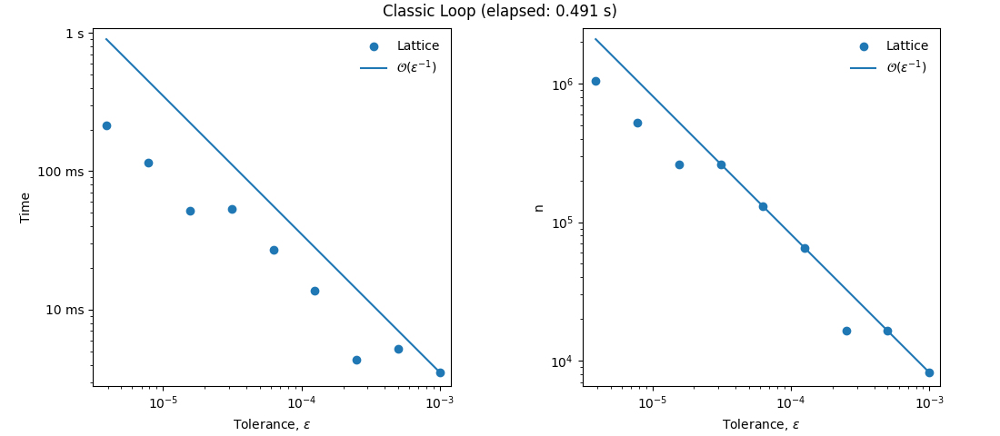
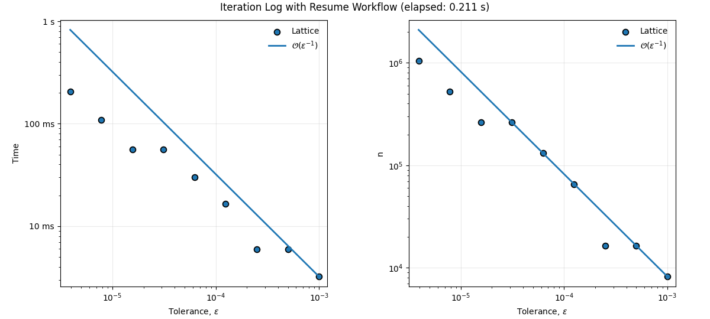

This post compares a classic tolerance sweep with QMCPy's iteration-log and
resume workflow for high-dimensional numerical integration.

The executable source is the
[`Iteration_Log_Tolerance_Demo.ipynb`](https://github.com/QMCSoftware/QMCSoftware/blob/develop/demos/demo_resume_data/Iteration_Log_Tolerance_Demo.ipynb)
notebook in the QMCPy repository.

In high-dimensional integration, achieving high precision in the solution
estimate often requires solving the same problem across a wide range of
tolerances ($\varepsilon$). Traditionally, this meant running the entire
simulation multiple times, leading to prohibitive computational costs. This
demo shows how QMCPy's resume feature and internal solver logs can reduce
redundant computation while maintaining the requested accuracy.

::: {.callout-note}
The runtimes below are empirical outputs saved in the source notebook and will
vary by machine and software environment. They are not theoretical performance
guarantees. The sample counts correspond to the stated methods, tolerances, and
random seed.
:::

## Approach 1: Classic loop

Following the setup in the
[`MCQMC2022_Article_Figures.ipynb`](https://github.com/QMCSoftware/QMCSoftware/blob/develop/demos/talk_paper_demos/MCQMC2022_Article_Figures/MCQMC2022_Article_Figures.ipynb)
notebook, we create two tolerance plots:

1. Time versus tolerance.
2. Number of samples, $n$, versus tolerance.

Both use log-log axes and compare the lattice results with an
$\mathcal{O}(\varepsilon^{-1})$ reference trend.

This naive approach re-runs the solver for every target tolerance, so it
discards work completed at earlier tolerances.

```python
import numpy as np
import pandas as pd
import matplotlib.pyplot as plt
from matplotlib.ticker import FuncFormatter
from time import perf_counter
import qmcpy as qp

tol0, n_tol = 1e-3, 9
tol = np.array([tol0 / (2**i) for i in range(n_tol)])

def run_lattice_tolerance_curve(seed):
    integ = qp.Keister(qp.Gaussian(qp.Lattice(3, seed=seed)))
    times, ns = [], []
    for eps in tol:
        _, data = qp.CubQMCLatticeG(
            integ, abs_tol=float(eps)
        ).integrate()
        times.append(float(data.time_integrate))
        ns.append(float(data.n_total))
    return np.asarray(times), np.asarray(ns)

def _time_fmt(y, _):
    """Format seconds at a scale appropriate for the plotted value."""
    if y >= 1:
        return f"{y:g} s"
    if y >= 1e-3:
        return f"{y * 1e3:g} ms"
    return f"{y * 1e6:g} us"

approach1_tic = perf_counter()
ld_time, ld_n = run_lattice_tolerance_curve(seed=7)
ref_time = (ld_time[0] * tol[0]) / tol
ref_n = (ld_n[0] * tol[0]) / tol
approach1_elapsed = perf_counter() - approach1_tic
print(f"Approach 1: elapsed={approach1_elapsed:.6f} s")

fig1, ax1 = plt.subplots(
    1, 2, figsize=(11, 4.8), constrained_layout=True
)
fig1.suptitle(f"Classic Loop (elapsed: {approach1_elapsed:.3f} s)")
for axis, values, reference, ylabel in zip(
    ax1,
    [ld_time, ld_n],
    [ref_time, ref_n],
    ["Time", "n"],
):
    axis.scatter(tol, values, color="tab:blue")
    axis.plot(tol, reference, color="tab:blue")
    axis.set_ylabel(ylabel)
    axis.set_xlim([tol.min() * 0.8, tol.max() * 1.2])
    axis.set_ylim([
        np.r_[values, reference].min() * 0.8,
        np.r_[values, reference].max() * 1.2,
    ])
    axis.set_xlabel("Tolerance, " + r"$\varepsilon$")
    axis.set_xscale("log")
    axis.set_yscale("log")
    axis.legend(
        ["Lattice", r"$\mathcal{O}(\varepsilon^{-1})$"],
        frameon=False,
    )
    axis.set_box_aspect(1)

ax1[0].yaxis.set_major_formatter(FuncFormatter(_time_fmt))
plt.show()
```

```text
Approach 1: elapsed=0.490905 s
```

{fig-alt="Two log-log plots showing elapsed time and total sample count against tolerance for independent fresh lattice runs."}

## Approach 2: Iteration log with resume

The solver first runs at the loosest tolerance and then resumes at
progressively tighter tolerances. Because each resumed run starts from the
previous state, the solver performs only the additional work needed for the
new accuracy target.

After an initial or resumed run, `get_iteration_log()` returns a pandas
`DataFrame` containing the stored iteration history. For QMC stopping
criteria, the error surrogate is typically `comb_bound_diff`; for
root-mean-square-error criteria, it may be `rmse_estimate` or `rmse_tol`.
Resumed runs must use the same solver instance.

The panels below plot cumulative elapsed time and sample count against
tolerance. Each point represents the work completed through that stopping
point.

```python
def collect_log_rows_resume(method_name, seed):
    """Resume through the tolerance sequence and return each stop row."""
    integ = qp.Keister(qp.Gaussian(qp.Lattice(3, seed=seed)))
    stopping_criterion = None
    data = None

    for eps in tol:  # loosest to tightest
        if stopping_criterion is None:
            stopping_criterion = qp.CubQMCLatticeG(
                integ, abs_tol=float(eps)
            )
            _, data = stopping_criterion.integrate()
        else:
            stopping_criterion.set_tolerance(abs_tol=float(eps))
            _, data = stopping_criterion.integrate(resume=data)

    result = stopping_criterion.get_iteration_log(
        formatted=False, view="stage_last"
    ).copy()
    result.insert(0, "method", method_name)
    result.insert(1, "abs_tol", np.asarray(tol)[: len(result)])
    columns = ["method", "abs_tol", "elapsed_time", "n_total"]
    return result[columns].sort_values(
        "abs_tol", ascending=False
    ).reset_index(drop=True)

approach2_tic = perf_counter()
iter_log = collect_log_rows_resume("Lattice", seed=7)
approach2_elapsed = perf_counter() - approach2_tic
print(f"Approach 2: elapsed={approach2_elapsed:.6f} s")

iter_log.head(9)
```

```text
Approach 2: elapsed=0.210797 s
```

| | method | absolute tolerance | cumulative time (s) | total samples |
|---:|:---|---:|---:|---:|
| 0 | Lattice | 0.001000 | 0.003221 | 8,192 |
| 1 | Lattice | 0.000500 | 0.005953 | 16,384 |
| 2 | Lattice | 0.000250 | 0.005953 | 16,384 |
| 3 | Lattice | 0.000125 | 0.016573 | 65,536 |
| 4 | Lattice | 0.000063 | 0.029973 | 131,072 |
| 5 | Lattice | 0.000031 | 0.056201 | 262,144 |
| 6 | Lattice | 0.000016 | 0.056201 | 262,144 |
| 7 | Lattice | 0.000008 | 0.109378 | 524,288 |
| 8 | Lattice | 0.000004 | 0.206681 | 1,048,576 |

```python
plot_df = iter_log.copy()
plot_df[["abs_tol", "elapsed_time", "n_total"]] = plot_df[
    ["abs_tol", "elapsed_time", "n_total"]
].apply(pd.to_numeric, errors="coerce")
plot_df = plot_df.sort_values(["method", "abs_tol"])

def _positive_finite(values):
    values = np.asarray(values, dtype=float)
    return values[np.isfinite(values) & (values > 0)]

def draw_panel(axis, y_column, y_label):
    data = plot_df[plot_df["method"] == "Lattice"].sort_values(
        "abs_tol"
    )
    x = data["abs_tol"].to_numpy(dtype=float)
    y = data[y_column].to_numpy(dtype=float)
    reference = y[-1] * x[-1] / x

    axis.scatter(
        x, y, color="tab:blue", marker="o", s=50,
        label="Lattice", edgecolors="black",
    )
    axis.plot(
        x, reference, color="tab:blue", linewidth=2,
        label=r"$\mathcal{O}(\varepsilon^{-1})$",
    )

    values = _positive_finite(np.r_[y, reference])
    axis.set_xscale("log")
    axis.set_yscale("log")
    axis.set_xlim([x.min() * 0.8, x.max() * 1.2])
    axis.set_ylim([values.min() * 0.8, values.max() * 1.25])
    axis.set_xlabel("Tolerance, " + r"$\varepsilon$")
    axis.set_ylabel(y_label)
    axis.grid(True, which="major", alpha=0.25)
    axis.legend(frameon=False)
    axis.set_box_aspect(1)

fig2, ax2 = plt.subplots(
    1, 2, figsize=(12, 5.4), constrained_layout=True
)
fig2.suptitle(
    f"Iteration Log with Resume Workflow "
    f"(elapsed: {approach2_elapsed:.3f} s)"
)
draw_panel(ax2[0], "elapsed_time", "Time")
draw_panel(ax2[1], "n_total", "n")
ax2[0].yaxis.set_major_formatter(FuncFormatter(_time_fmt))
plt.show()
```

{fig-alt="Two log-log plots showing cumulative elapsed time and total sample count against tolerance for the resumed lattice workflow."}

Although the two sets of plots look similar, the second workflow reuses prior
work instead of starting fresh at every tolerance.

## Repeated timing comparison

A single `perf_counter()` measurement is noisy, so the notebook also uses
`timeit.repeat()` to run each workflow ten times.

```python
import timeit

REPEAT = 10

def run_approach1_once():
    times, sample_counts = run_lattice_tolerance_curve(seed=7)
    return float(times.sum()), float(sample_counts[-1])

def run_approach2_once():
    log = collect_log_rows_resume("Lattice", seed=7)
    return (
        float(log["elapsed_time"].iloc[-1]),
        float(log["n_total"].iloc[-1]),
    )

def benchmark_callable(function, repeat=REPEAT):
    samples = np.asarray(
        timeit.repeat(function, number=1, repeat=repeat),
        dtype=float,
    )
    return pd.Series({
        "average": float(samples.mean()),
        "stdev": float(samples.std(ddof=1)),
        "min": float(samples.min()),
        "max": float(samples.max()),
        "repeat": int(repeat),
    })

benchmark_results = pd.DataFrame({
    "Classic Loop": benchmark_callable(run_approach1_once),
    "Iteration Log + Resume": benchmark_callable(run_approach2_once),
}).T
benchmark_results
```

| workflow | average (s) | standard deviation (s) | minimum (s) | maximum (s) | repeats |
|:---|---:|---:|---:|---:|---:|
| Classic Loop | 0.459063 | 0.006500 | 0.449794 | 0.469225 | 10 |
| Iteration Log + Resume | 0.212442 | 0.009557 | 0.202143 | 0.229744 | 10 |

## Conclusion

For this multi-tolerance experiment, the iteration-log and resume workflow
avoids repeatedly solving the same problem from scratch. It gives researchers
access to the solver history and reuses completed work when the target
tolerance is tightened.

The gain here applies to sequential tolerance exploration. If the final tight
tolerance is already known, running directly at that tolerance remains the
appropriate baseline.
