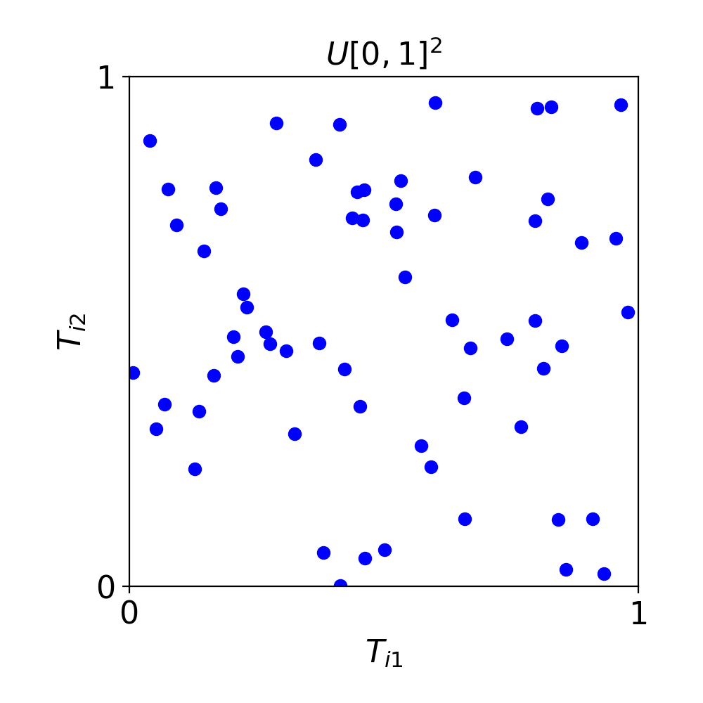
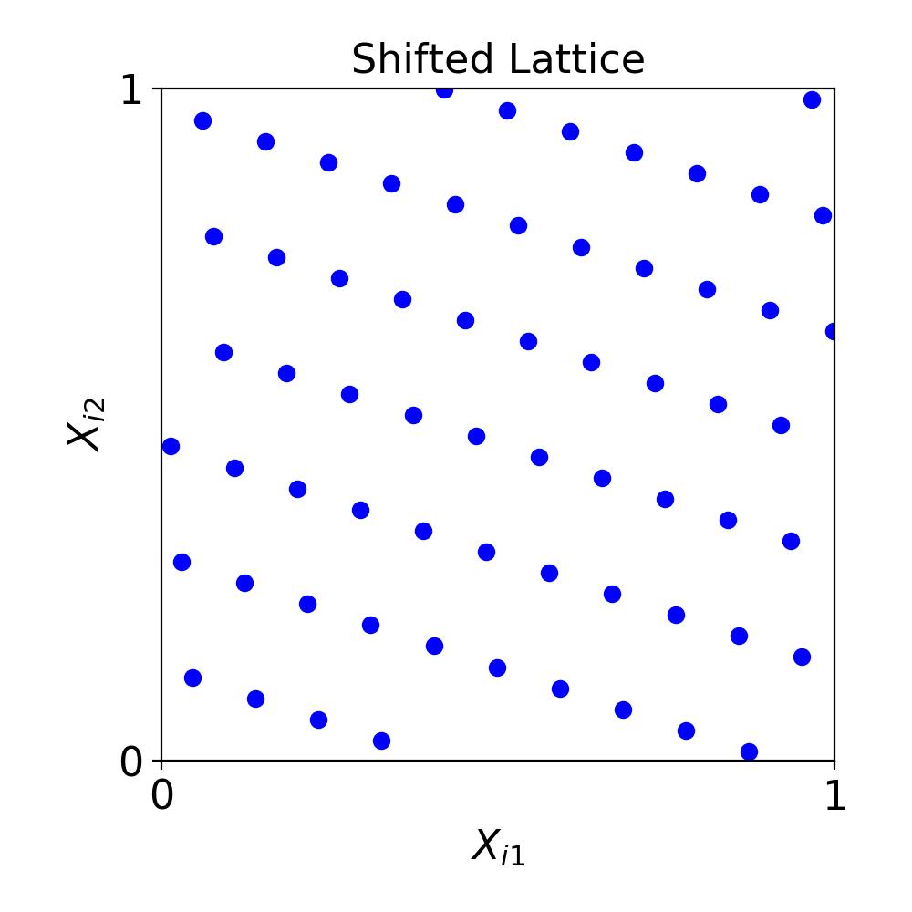

This post motivates quasi-Monte Carlo by comparing IID sampling with more evenly spread points for numerical integration.

Quasi-Monte Carlo (QMC) methods can sometimes speed up simple Monte Carlo (MC) calculations by orders of magnitude. What makes them work so well?

MC methods use computer-generated random numbers to generate various scenarios. When computing financial risk, the scenarios may be possible financial market outcomes. When assessing the resiliency of the power grid, the scenarios represent power demand and power grid failures under different future weather conditions.

If $Y$ is the quantity of interest, e.g., profit (or loss) one month from now, and $Y_1, \ldots, Y_n$ are its possible values under the possible scenarios generated by a stochastic model, then we can estimate the *mean* or average quantity of interest from these computer-generated data as follows

$$
\mu = \mathbb{E}(Y) \approx \frac{1}{n} \bigl ( Y_1 + \cdots + Y_n \bigr) = \hat{\mu}_n.
$$

The sample mean based on $n$ scenarios approximates the true mean, which is based on an infinite number of scenarios.

Simple MC chooses $Y_1, \ldots, Y_n$ to be independent and identically distributed (IID). Intuitively, this means that any $Y_i$ bears no relationship to any other $Y_k$, and all $Y_i$ come from the same probability distribution or scenario-generating model.

This is good, but we can do better. By choosing $Y_1, \ldots, Y_n$ to be more representative of the infinite number of possible scenarios, we can make $\hat{\mu}$ a better estimate of the mean, $\mu$.

The model that generates $Y$ is often written as $Y= f(\boldsymbol{X})$, where $\boldsymbol{X}$ is a uniformly distributed vector in the $d$-dimensional unit cube $[0,1]^d$. If $Y_i = f(\boldsymbol{X}_i)$ for IID $\boldsymbol{X}_i$, then we have simple MC. Figure 1 shows a picture of IID uniform $\boldsymbol{X}_1, \ldots, \boldsymbol{X}_{64}$ in two dimensions. Because the points are IID, there are gaps and clusters.

<figure id="fig-iid-uniform-points">
  
  <figcaption>Figure 1: 64 IID standard uniform points in 2 dimensions.</figcaption>
</figure>

Figure 2 gives an example of $\boldsymbol{X}_1, \ldots, \boldsymbol{X}_{64}$ used in QMC methods. These points are called integration lattice points. Note that they more evenly fill the square than the IID points in Figure 1.

<figure id="fig-lattice-points">
  
  <figcaption>Figure 2: 64 shifted lattice points in 2 dimensions.</figcaption>
</figure>

Because these QMC points are more even, they can sometimes reduce integration error much faster than IID sampling. In favorable cases, one may observe an error rate near $\mathcal{O}(n^{-1})$, while the typical statistical error for simple MC decreases like $\mathcal{O}(n^{-1/2})$. The rate $\mathcal{O}(n^{-1})$ is an illustration, not a guarantee: actual convergence depends on both the integrand and the QMC construction. That potential improvement is the reason to add Q to MC.

QMCPy [1] is our open source Python library that implements QMC methods, including point generators, cubatures, and stopping criteria. A tutorial on QMC is given in [2].  This blog introduces you to QMC and QMCPy.

## When does QMC help?

More evenly distributed points can substantially improve integration accuracy,
but the size of the improvement depends on the problem. QMC tends to work best
when the integrand is sufficiently smooth or regular and when most of its
variation is driven by a relatively small number of important variables or
low-order interactions—what is often called low *effective dimension*.

How a problem is formulated also matters. Transformations, the ordering of
variables, and other modeling choices can make important structure easier or
harder for a QMC rule to exploit. The low-discrepancy point set should suit the
problem, and randomization is useful when repeated estimates are needed to
assess error. Thus, neither even spacing nor a nominal dimension alone
determines the convergence rate.

## How QMCPy makes QMC practical

QMCPy brings the pieces of a QMC computation into one framework. It provides:

- low-discrepancy sequences and lattices,
- randomized constructions,
- transformations for probability distributions,
- integrands and applications, and
- stopping criteria and error assessment.

A future revision or companion post will include a short, runnable QMCPy
comparison of IID Monte Carlo and randomized QMC.

## References

1. S.-C. T. Choi, F. J. Hickernell, R. Jagadeeswaran, A. Jain, and A. Sorokin, QMCPy: a quasi-Monte Carlo Python library (version 2.3), DOI: 10.5281/zenodo.20297697

2. F. J. Hickernell, N. Kirk, and A. G. Sorokin, Quasi-Monte Carlo methods: what, why, and how?
In C. Lemieux and B. Feng, editors, Monte Carlo and quasi-Monte Carlo methods: MCQMC, Waterloo, Canada, August 2024, Springer, Cham, 2026
