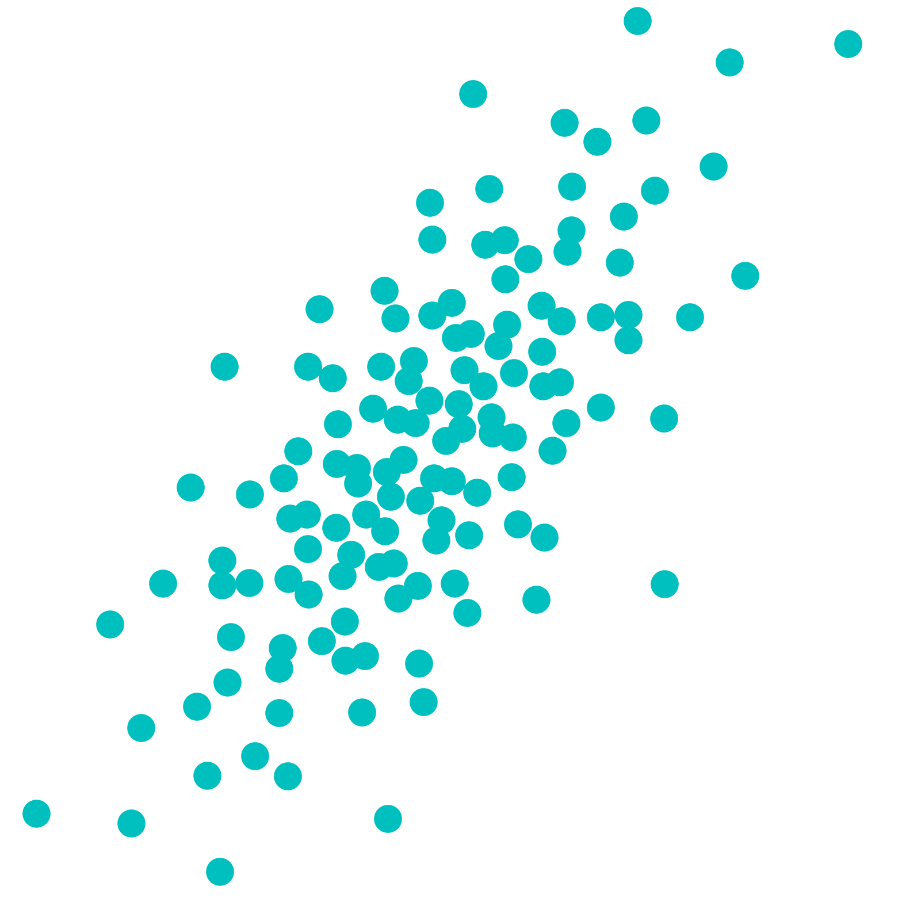

::: {.hero}
:::: {.grid .align-items-center}
::: {.g-col-12 .g-col-lg-8 .hero-copy}
## Quasi-Monte Carlo methods in Python (QMCPy)

An open-source Python library for quasi-Monte Carlo sampling and integration

:::{.hero-actions}
[Read the documentation](https://qmcsoftware.github.io/QMCSoftware/){.btn .btn-primary}
[View QMCPy on GitHub](https://github.com/QMCSoftware/QMCSoftware){.btn .btn-outline-primary}
:::
:::

::: {.g-col-12 .g-col-lg-4 .hero-mark}

:::
::::
:::

## Explore QMCPy

:::: {.grid}
::: {.g-col-12 .g-col-md-4}
### Learn

Use the existing technical documentation for installation, examples, demos,
and the package reference.

[Open the documentation →](https://qmcsoftware.github.io/QMCSoftware/)
:::

::: {.g-col-12 .g-col-md-4}
### Follow

The [blog](blog/index.qmd) and [news and events](news/index.qmd) sections will
collect project updates as the site develops.
:::

::: {.g-col-12 .g-col-md-4}
### Participate

Visit the [community page](community/index.qmd) for established ways to learn
about and contribute to the project.
:::
::::

::: {.callout-note appearance="simple"}
This public website is an early prototype. QMCPy's maintained technical
documentation continues to live at the documentation link above.
:::
